# tkstarDev Development Roadmap

> **생성일**: 2026-05-13 | **문서 버전**: 0.2 | **PRD**: [docs/PRD.md](/docs/PRD.md) | **작성자**: roadmap-generator

1인 기업(개발자) 개인 브랜드 사이트 `tkstar.dev` — React Router v7 Framework + Cloudflare Workers SSR + Clean Architecture 4-layer. 본 로드맵은 PRD(F001~F023, F015 Removed 제외) 와 PROJECT-STRUCTURE 를 task 단위로 분해한 정본이며, Structure-First → Inside-Out (Domain → Application → Infrastructure → Presentation) → TDD-First 순서를 따른다. P0~P6 은 MVP 배포 완료, P7~P10 (구 Phase 7.1~7.4) 은 CMS 인프라 단계.

## Overview
- 사이트 자체가 이력서: B2B(채용/HR) 와 B2C(프리랜서 의뢰) 양쪽 청중을 콘텐츠 라우팅(About / Projects) 으로 자연 수렴
- 검색 우선 네비게이션: Cmd+K Command Palette (F016) 가 주 네비게이션 패러다임
- 이중 콘텐츠 파이프라인: Project / AppLegalDoc 은 velite + MDX (빌드 타임 정적 ETL, Zod frontmatter 검증), Post 는 Cloudflare D1 + Drizzle ORM (런타임 SSR + KV cache)
- Edge SSR + 동적 OG: Cloudflare Workers + Satori standalone + Asset Binding 으로 슬러그별 OG 1200×630 이미지 생성
- 운영 비용 0원 지향 + 단일 admin: Cloudflare Workers/Email Routing/Web Analytics/Turnstile + Resend 무료 티어, admin 은 본인 1명 Cloudflare Access (GitHub OAuth)

## Phase 진행 현황
| Phase | 제목 | 상태 | Tasks |
| --- | --- | --- | --- |
| P0 | Phase 0: Setup & Toolchain | ✅ Completed | T001, T002, T003 |
| P1 | Phase 1: Foundation — Routing Skeleton + Domain Schemas + Theme | ✅ Completed | T004, T005, T006 |
| P2 | Phase 2: Content Pipeline — velite + MDX + shiki + Repository | ✅ Completed | T007, T008, T009 |
| P3 | Phase 3: Core Pages UI — Home/About/Projects/Blog/Legal (실 데이터 연결) | ✅ Completed | T010, T011, T012, T013, T014, T015, T041 |
| P4 | Phase 4: Forms / Email — Command Palette + Contact Form + Turnstile + Resend | ✅ Completed | T016, T017, T042 |
| P5 | Phase 5: SEO / OG / Indexing — Satori OG + Sitemap + Robots + JSON-LD + 검색엔진 등록 | ✅ Completed | T018, T019, T020 |
| P6 | Phase 6: Polish & Deploy — QA + 배포 + 도메인 연결 | ✅ Completed | T021, T022, T043 |
| P7 | Phase 7.1: CMS Read Path First — 번들 PoC + D1/Drizzle + 마이그레이션 + 런타임 컴파일러 | ✅ Completed | T023, T024, T025, T026, T027, T028 |
| P8 | Phase 7.2: CMS Auth + Admin Foundation — Cloudflare Access + JWT 검증 + Admin shell | ⏳ Pending | T029, T030, T031, T032 |
| P9 | Phase 7.3: CMS Admin Editor + Media — R2 + Tiptap + Upload + Editor | ⏳ Pending | T033, T034, T035, T036, T037 |
| P10 | Phase 7.4: CMS Project Meta + Search Index — D1 분리 + buildSearchIndex use case 분리 | ⏳ Pending | T038, T039, T040 |

## P0: Phase 0: Setup & Toolchain ✅

빈 React Router v7 + Cloudflare Workers + Clean Architecture 4-layer 프로젝트 골격을 만들고, 빌드/테스트/린트 파이프라인을 가동시킨다.

- [x] **T001 — chore: 프로젝트 스캐폴딩 + Bun + TypeScript + Biome 셋업**✅
  - **blockedBy**: none
  - **blocks**: T002, T003
  - **Must Read**: [T001-scaffold-bun-rr7-biome.md](/docs/tasks/T001-scaffold-bun-rr7-biome.md)
  - 빈 git 저장소에 Bun + TypeScript + Biome 기반의 빈 프로젝트 셸을 깔아, 이후 모든 phase 의 진입 조건인 `bun --version` / `bun run typecheck` / `bun run lint` / `bun run format` 을 무오류 통과시킨다. 모든 후속 task 는 이 셸 위에서 동작하므로 toolchain 일관성 확보가 본 task 의 단일 책임이다.

- [x] **T002 — chore: Clean Architecture 4-layer 디렉토리 골격 + path alias**✅
  - **blockedBy**: T001
  - **blocks**: T004, T006, T007, T008, T009
  - **Must Read**: [T002-ca-4layer-skeleton.md](/docs/tasks/T002-ca-4layer-skeleton.md)
  - Clean Architecture 4-layer (Domain / Application / Infrastructure / Presentation) 의 빈 디렉토리 골격과 placeholder index 를 만들고, 의존성 방향(Domain ← Application ← Infrastructure / Presentation ← Application) 을 README 또는 Lint 로 문서화한다. 이후 모든 task 는 이 골격 안의 명확한 layer 에 배치된다.

- [x] **T003 — chore: Vite + React Router v7 Framework + Cloudflare Workers + Tailwind v4 빌드 파이프라인**✅
  - **blockedBy**: T001
  - **blocks**: T004, T005, T016
  - **Must Read**: [T003-vite-rr7-workers-tailwind-pipeline.md](/docs/tasks/T003-vite-rr7-workers-tailwind-pipeline.md)
  - Vite + React Router v7 Framework + Cloudflare Workers + Tailwind v4 + Vitest coverage 파이프라인을 가동시켜, SSR 첫 응답·dev 서버·테스트 커버리지 리포트가 모두 무오류로 동작하는 상태를 만든다. 이후 모든 페이지·라우트·테스트가 이 파이프라인 위에서 동작.

## P1: Phase 1: Foundation — Routing Skeleton + Domain Schemas + Theme ✅

PRD 에 정의된 모든 라우트의 빈 모듈을 만들고, Domain layer 의 콘텐츠 스키마를 Zod 로 확정한다. F010 다크모드 전략을 root layout 에 심는다.

- [x] **T004 — feature: 라우트 스켈레톤 13개 + chrome / chrome-free 레이아웃**✅
  - **blockedBy**: T002, T003
  - **blocks**: T010, T011, T012, T013, T014, T015
  - **Must Read**: [T004-route-skeleton.md](/docs/tasks/T004-route-skeleton.md)
  - **PRD Features**: F014, F018, F019, F004
  - PRD 의 모든 페이지·resource route 에 해당하는 빈 라우트 파일을 만들고, ChromeLayout / ChromeFreeLayout 두 레이아웃을 도입한다. 각 URL 을 직접 입력 시 placeholder 응답이 와야 하며, App Terms/Privacy 는 chrome-free, splat 라우트는 Not Found Fallback placeholder.

- [x] **T005 — feature: 디자인 토큰 이식 + Tailwind v4 `@theme` + `[data-theme]` dark variant + 다크모드 (F010)**✅
  - **blockedBy**: T003
  - **blocks**: T010, T011, T012, T013, T014, T015
  - **Must Read**: [T005-theme-tokens.md](/docs/tasks/T005-theme-tokens.md)
  - **PRD Features**: F010
  - design 정본의 oklch 토큰을 Tailwind v4 `@theme` block 으로 이식하고, `[data-theme]` 속성 기반 dark variant 와 시스템 추종 + localStorage `proto-theme` 강제 전환 hook 을 구현한다. SSR-safe blocking script 로 첫 렌더부터 정확한 테마가 보이도록 한다 (FOIT 없음).

- [x] **T006 — feature: Domain Schemas — Project / Post / AppLegalDoc / ContactSubmission / ThemePreference**✅
  - **blockedBy**: T002
  - **blocks**: T007, T008, T009
  - **Must Read**: [T006-domain-schemas.md](/docs/tasks/T006-domain-schemas.md)
  - **PRD Features**: F002, F004, F005, F006, F007, F008, F010, F014, F017
  - Domain layer (innermost) 의 콘텐츠·폼·테마 스키마를 Zod 로 확정한다. velite frontmatter 검증, Contact form validation, ThemePreference VO 의 source-of-truth 를 만들어 이후 Application/Infrastructure layer 가 의존할 수 있는 안정적 contract 를 제공.

## P2: Phase 2: Content Pipeline — velite + MDX + shiki + Repository ✅

velite 로 content/{projects,posts,legal}/*.mdx 를 빌드하여 .velite/ JSON 으로 출력하고, Infrastructure Repository 로 Domain Entity 에 매핑한다. Application 콘텐츠 유스케이스를 TDD 로 구현한다.

- [x] **T007 — feature: velite 설치 + 컬렉션 정의 + seed 콘텐츠 + shiki 코드블록**✅
  - **blockedBy**: T006
  - **blocks**: T008
  - **Must Read**: [T007-velite-content-pipeline.md](/docs/tasks/T007-velite-content-pipeline.md)
  - **PRD Features**: F004, F005, F006, F007, F014
  - velite 를 도입하여 `content/{projects,posts,legal/apps}/**/*.mdx` 를 빌드 타임에 `.velite/{projects,posts,legal}.json` 으로 출력한다. rehype-slug + shiki 코드블록 + seed 콘텐츠 (project 1개 / post 1개 / legal 1쌍) 를 함께 도입해 후속 task 들이 즉시 콘텐츠 렌더링 검증 가능하게 한다.

- [x] **T008 — feature: Application Ports + Content Repositories (Infrastructure 구현)**✅
  - **blockedBy**: T002, T006, T007
  - **blocks**: T009, T010, T011, T012, T013, T014, T015, T016, T017
  - **Must Read**: [T008-content-ports-repos.md](/docs/tasks/T008-content-ports-repos.md)
  - **PRD Features**: F004, F005, F006, F007, F014, F017
  - Application layer 의 read-side 콘텐츠 유스케이스 (list/detail/featured/recent/related) 를 ports + services 로 정의하고, Infrastructure layer 의 velite repository 어댑터로 Domain Entity 에 매핑한다. 모든 페이지 task 가 의존하는 read-side contract 의 SoT.

- [x] **T009 — feature: DI Container (Composition Root) + workers/app.ts wiring + AppLoadContext**✅
  - **blockedBy**: T008
  - **blocks**: T010, T011, T012, T013, T014, T015, T016, T017
  - **Must Read**: [T009-di-container.md](/docs/tasks/T009-di-container.md)
  - Composition Root 를 Infrastructure config 에 두고, 모든 services 를 plain object 로 묶은 `Container` 를 `buildContainer(env)` 로 생성한다. workers/app.ts 의 fetch handler 두 번째 인자에 주입하여 React Router loader/action 에서 `context.container.*` 로 접근 가능하게 한다.

## P3: Phase 3: Core Pages UI — Home/About/Projects/Blog/Legal (실 데이터 연결) ✅

Phase 1 의 빈 라우트에 Phase 2 의 콘텐츠 유스케이스를 연결하여 실제 페이지를 완성한다. F003 PDF 인쇄 스타일, F017 Featured/Recent 포함.

- [x] **T010 — feature: Home Page (F001 Hero + F017 Featured/Recent)**✅
  - **blockedBy**: T005, T008, T009
  - **blocks**: T016
  - **Must Read**: [T010-home-page.md](/docs/tasks/T010-home-page.md)
  - **PRD Features**: F001, F017
  - Home 라우트의 placeholder 를 실 콘텐츠로 채운다 — Hero (whoami + 3-버튼 클러스터), Featured Project 큰 카드 1개, Recent Posts 3개 행, '모두 보기 →' 링크. Featured 미존재 시 fallback (해당 섹션 미렌더) 처리.

- [x] **T011 — feature: About Page (F002 사이트 자체 이력서 + F003 PDF 인쇄 스타일)**✅
  - **blockedBy**: T005, T006, T009
  - **blocks**: none
  - **Must Read**: [T011-about-page.md](/docs/tasks/T011-about-page.md)
  - **PRD Features**: F002, F003, F018
  - About 라우트를 '사이트 자체가 이력서' 컨셉으로 채운다 — Mission / About me / Skills / Career / Education / Certifications / Awards / Languages / Tools 섹션 + 다운로드 가능한 자격증 카드. F003 의 PDF 인쇄 스타일 (CSS `@media print`) 을 도입해 Cmd+P 단축키로 깔끔한 1-3쪽 이력서가 생성되도록 한다.

- [x] **T012 — feature: Projects List Page (F004 ls-style 그리드 + 필터)**✅
  - **blockedBy**: T005, T008, T009
  - **blocks**: T013
  - **Must Read**: [T012-projects-list-page.md](/docs/tasks/T012-projects-list-page.md)
  - **PRD Features**: F004, F018
  - Projects 목록 라우트를 ls-style 그리드 (`Name`/`Type`/`Status`/`Stack`/`Period` 열) 로 채우고, `?tag=` 쿼리 파라미터로 태그 필터를 지원한다. velite project collection → listProjects() service → ProjectCard 렌더.

- [x] **T013 — feature: Project Detail Page (F005 Case Study + Related + prev/next)**✅
  - **blockedBy**: T007, T008, T009, T012
  - **blocks**: none
  - **Must Read**: [T013-project-detail-page.md](/docs/tasks/T013-project-detail-page.md)
  - **PRD Features**: F005, F018
  - Project Case Study 라우트를 채운다 — TL;DR / Problem / Approach / Decisions / Trade-offs / Result / Stack / Links 섹션 + Related Projects 2-4개 + prev/next 인접 프로젝트 네비게이션. velite project body → MdxRenderer 로 렌더.

- [x] **T014 — feature: Blog List Page (F006) + RSS Feed (F012)**✅
  - **blockedBy**: T005, T008, T009
  - **blocks**: T041
  - **Must Read**: [T014-blog-list-rss.md](/docs/tasks/T014-blog-list-rss.md)
  - **PRD Features**: F006, F012, F018
  - Blog 목록 라우트를 채우고, 동시에 `/rss.xml` resource route 를 활성화한다. 발행된 post 만 노출 (`draft: false`), 날짜 DESC 정렬, 태그 필터 (`?tag=`), Atom 1.0 또는 RSS 2.0 피드 생성.

- [x] **T015 — feature: Legal Routes (F014 App Terms/Privacy + Legal Index)**✅
  - **blockedBy**: T004, T006, T007, T008
  - **blocks**: none
  - **Must Read**: [T015-legal-routes.md](/docs/tasks/T015-legal-routes.md)
  - **PRD Features**: F014, F018
  - 앱별 약관/개인정보처리방침 라우팅 (`/legal/$app/terms`, `/legal/$app/privacy`) 을 활성화한다. velite legal collection → AppLegalDoc Entity → ChromeFreeLayout 으로 렌더. Legal Index (`/legal`) 는 앱 목록 + 각 앱의 terms/privacy 링크.

- [x] **T041 — feature: Blog Detail Page (F007) — D1 데이터 + MDX 런타임 + Related/PrevNext**✅
  - **blockedBy**: T007, T008, T009, T014
  - **blocks**: T019, T021
  - **Must Read**: [T041-blog-detail-page.md](/docs/tasks/T041-blog-detail-page.md)
  - **PRD Features**: F007, F018
  - Blog 상세 라우트 (`/blog/$slug`) 를 채운다 — D1 의 post 본문을 MdxRenderer (또는 T027 의 런타임 컴파일러) 로 렌더, 발행일/태그/cover/excerpt 헤더, Related 2-3개, prev/next 인접 포스트 네비게이션. F007 의 모든 AC 충족.

## P4: Phase 4: Forms / Email — Command Palette + Contact Form + Turnstile + Resend ✅

Cmd+K palette 본격 가동, Contact Form 검증 + Turnstile + Resend + KV rate-limit 까지 TDD 로 구현.

- [x] **T016 — feature: Cmd+K Command Palette (F016)**✅
  - **blockedBy**: T003, T008, T010
  - **blocks**: none
  - **Must Read**: [T016-command-palette.md](/docs/tasks/T016-command-palette.md)
  - **PRD Features**: F001, F016
  - 검색 우선 네비게이션 — Cmd+K (macOS) / Ctrl+K (Win/Linux) 단축키 + Topbar 검색 버튼으로 트리거되는 모달 palette 를 구현한다. 빌드 타임 생성된 `/search-index.json` 을 fetch + client-side filter (단순 includes + 점수) 로 즉시 결과 렌더.

- [x] **T017 — feature: Contact Form (F008) + Turnstile (F009) + Resend + KV rate-limit**✅
  - **blockedBy**: T006, T009
  - **blocks**: T042
  - **Must Read**: [T017-contact-form-turnstile-resend.md](/docs/tasks/T017-contact-form-turnstile-resend.md)
  - **PRD Features**: F008, F009
  - 방문자 → 본인 이메일 contact 채널을 완성한다. ContactSubmission 검증 (Domain) + Cloudflare Turnstile 검증 (Application) + Resend 이메일 발송 (Infrastructure) + KV rate-limit (IP 당 5분 5회). 성공 시 thank-you 페이지, 실패 시 inline 에러.

- [x] **T042 — docs: PROJECT-STRUCTURE 갱신 — Contact rate-limit + KV binding 문서화 (T017 후속)**✅
  - **blockedBy**: T017
  - **blocks**: T021
  - **Must Read**: [T042-contact-rate-limit-structure-update.md](/docs/tasks/T042-contact-rate-limit-structure-update.md)
  - **PRD Features**: F008, F009
  - T017 (Contact Form + Turnstile + Resend + KV rate-limit) 머지 후, `docs/PROJECT-STRUCTURE.md` 가 KV 바인딩 / rate-limiter 모듈 / Turnstile verifier 위치를 반영하지 못한 채로 남아 후속 task 의 layer 배치 판단이 흐려진 문제를 해소한다. 코드 변경 없음 — 문서만 갱신.

## P5: Phase 5: SEO / OG / Indexing — Satori OG + Sitemap + Robots + JSON-LD + 검색엔진 등록 ✅

F011 동적 OG 이미지, F018 SEO 메타 + sitemap/robots + JSON-LD, F019 Google/Naver 검색엔진 등록을 완성한다.

- [x] **T018 — feature: Satori OG Images (F011) — Project/Blog 슬러그별 1200×630**✅
  - **blockedBy**: T013, T041
  - **blocks**: T019
  - **Must Read**: [T018-satori-og-images.md](/docs/tasks/T018-satori-og-images.md)
  - **PRD Features**: F011, F018
  - Project / Blog 슬러그별 동적 OG 이미지 (1200×630 PNG) 를 Satori standalone 런타임으로 생성하고, Cloudflare Workers Asset Binding 으로 폰트를 로드한다. KV 캐시로 hit ratio 확보, SSR meta 의 og:image 가 실제 endpoint 를 가리키게 한다.

- [x] **T019 — feature: SEO Meta + Sitemap + Robots + JSON-LD (F018)**✅
  - **blockedBy**: T010, T011, T012, T013, T014, T015, T018, T041
  - **blocks**: T020
  - **Must Read**: [T019-seo-sitemap-robots-jsonld.md](/docs/tasks/T019-seo-sitemap-robots-jsonld.md)
  - **PRD Features**: F018
  - 전체 페이지의 SEO 메타 (title/description/canonical/og:*/twitter:*) 표준화 + `/sitemap.xml` + `/robots.txt` 활성화 + JSON-LD (Person / WebSite / BreadcrumbList / Article / SoftwareApplication) 임베드. F018 의 모든 AC 충족.

- [x] **T020 — feature: 검색엔진 등록 (F019) + Cloudflare Web Analytics (F013)**✅
  - **blockedBy**: T019
  - **blocks**: T022
  - **Must Read**: [T020-search-engine-registration-analytics.md](/docs/tasks/T020-search-engine-registration-analytics.md)
  - **PRD Features**: F013, F019
  - Google Search Console + Naver Search Advisor 소유권 인증 메타/파일을 도입하고, Cloudflare Web Analytics 비콘을 root layout 에 임베드한다. 검색엔진 색인 요청은 T022 (배포 후) 수행.

## P6: Phase 6: Polish & Deploy — QA + 배포 + 도메인 연결 ✅

전체 플로우 QA, Lighthouse / Axe 접근성 점검, Cloudflare Workers 첫 배포 + tkstar.dev 도메인 연결 + Email Routing + Search Console 인증 완료.

- [x] **T021 — chore: 전체 플로우 QA + Lighthouse + Axe 접근성 점검 + 커버리지 게이트**✅
  - **blockedBy**: T010, T011, T012, T013, T014, T015, T016, T017, T018, T019, T020, T041
  - **blocks**: T022, T043
  - **Must Read**: [T021-qa-lighthouse-axe.md](/docs/tasks/T021-qa-lighthouse-axe.md)
  - **PRD Features**: F001, F002, F003, F004, F005, F006, F008, F010, F011, F012, F014, F016, F017, F018
  - MVP 배포 직전, 모든 페이지·라우트·폼·OG·SEO 경로를 수동/자동으로 검증한다. Lighthouse 4 카테고리 (Performance / Accessibility / Best Practices / SEO) 모두 90 이상, Axe critical/serious 0건, Vitest coverage threshold 통과를 게이트로 한다.

- [x] **T022 — chore: Cloudflare Workers 첫 배포 + tkstar.dev 도메인 연결 + Email Routing + Search Console 인증**✅
  - **blockedBy**: T021, T043
  - **blocks**: none
  - **Must Read**: [T022-deploy-domain-search-console.md](/docs/tasks/T022-deploy-domain-search-console.md)
  - **PRD Features**: F008, F019
  - 검증 통과한 빌드를 Cloudflare Workers production env 에 처음으로 배포하고, `tkstar.dev` 커스텀 도메인을 연결한다. Email Routing 으로 `contact@tkstar.dev` → 본인 inbox, Search Console (Google + Naver) 소유권 인증을 완료한다.

- [x] **T043 — fix: MdxRenderer Workers V8 eval fix — `@mdx-js/rollup` + `import.meta.glob` 패턴**✅
  - **blockedBy**: T007, T013, T015, T021, T041
  - **blocks**: T022
  - **Must Read**: [T043-mdx-renderer-workers-v8-eval-fix.md](/docs/tasks/T043-mdx-renderer-workers-v8-eval-fix.md)
  - **PRD Features**: F005, F007, F014
  - T007 의 자체 `evaluateMdxBody` (12 LOC, `new Function` 기반) 가 Cloudflare Workers V8 isolate 에서 일부 MDX 콘텐츠에 대해 `EvalError: Code generation from strings disallowed` 또는 `SyntaxError` 로 실패하는 회귀를 해소한다. 빌드 타임 컴파일 (`@mdx-js/rollup`) + `import.meta.glob` 정적 import 패턴으로 대체.

## P7: Phase 7.1: CMS Read Path First — 번들 PoC + D1/Drizzle + 마이그레이션 + 런타임 컴파일러

익명 방문자의 read path (Blog List/Detail) 가 D1 + KV cache 로 동작하도록 전환한다. Auth/Admin UI 는 본 phase 에 없음.

- [x] **T023 — chore: CMS 번들링 PoC — `nodejs_compat` + 종속성 호환성 검증**✅
  - **blockedBy**: T022
  - **blocks**: T024, T025, T026, T027, T033
  - **Must Read**: [T023-cms-bundling-poc.md](/docs/tasks/T023-cms-bundling-poc.md)
  - **PRD Features**: F020, F021, F022
  - Phase 7.x CMS 인프라 도입 전, Workers runtime 에서 D1 (Drizzle) + R2 + Tiptap (admin) + MDX 런타임 컴파일 (`@mdx-js/mdx`) 등 신규 의존성이 함께 번들·실행 가능한지 PoC 한다. `nodejs_compat` flag 활성, AsyncLocalStorage 충돌 점검, bundle size 측정, cold start 영향 평가까지가 단일 책임.

- [x] **T024 — feature: Drizzle ORM + D1 binding + schema 모듈 + migration 환경 셋업**✅
  - **blockedBy**: T023
  - **blocks**: T025, T038
  - **Must Read**: [T024-drizzle-d1-setup.md](/docs/tasks/T024-drizzle-d1-setup.md)
  - **PRD Features**: F021
  - Phase 7.x 의 데이터 백본인 Cloudflare D1 + Drizzle ORM 을 도입하고, 마이그레이션 파이프라인을 가동시킨다. 본 task 자체엔 테이블이 1개도 정의되어 있지 않아도 무방 — D1 binding + drizzle.config.ts + migration script + dev/preview/production 3-env 가 동작하면 통과.

- [x] **T025 — feature: Post D1 스키마 + 첫 마이그레이션 + Domain entity 재정렬**✅
  - **blockedBy**: T024
  - **blocks**: T026, T027, T028, T030, T032, T036
  - **Must Read**: [T025-post-d1-schema-migration.md](/docs/tasks/T025-post-d1-schema-migration.md)
  - **PRD Features**: F021, F007
  - Phase 7.1 의 핵심 — Blog Post 를 velite collection 에서 D1 테이블로 옮긴다. Drizzle schema 정의 + 첫 migration + Domain Post entity 재정렬 (slug / title / excerpt / body_mdx / tags / status / cover / published_at / updated_at / id 등) + post.schema.ts 의 Zod 갱신.

- [x] **T026 — feature: PostRepository D1 어댑터 + Application service 전환**✅
  - **blockedBy**: T025
  - **blocks**: T027, T028
  - **Must Read**: [T026-post-d1-repository.md](/docs/tasks/T026-post-d1-repository.md)
  - **PRD Features**: F021, F006, F007, F017
  - T025 의 D1 schema 위에 PostRepository 의 D1 어댑터를 작성하고, 기존 velite repository 를 교체한다. Application services (listPosts / getPostDetail / getRecentPosts) 는 port 만 의존하므로 변경 없음 — DI container 에서 어댑터 swap.

- [x] **T027 — feature: MDX 런타임 컴파일러 + KV 캐시 (Post body)**✅
  - **blockedBy**: T026
  - **blocks**: T040
  - **Must Read**: [T027-mdx-runtime-compiler-kv-cache.md](/docs/tasks/T027-mdx-runtime-compiler-kv-cache.md)
  - **PRD Features**: F020, F021, F007
  - D1 의 `body_mdx` 컬럼을 SSR 요청 시 `@mdx-js/mdx` 로 compile + evaluate 하여 React Element 로 렌더한다. compile 비용 보호를 위해 KV 캐시 (`mdx:post:<id>:<updated_at>` → compiled JS module string) 도입. cache miss 시만 compile 실행.

- [x] **T028 — chore: Post seed migration — velite → D1 데이터 이관 + velite collection 폐기** ✅
  - **blockedBy**: T026, T027
  - **blocks**: T032
  - **Must Read**: [T028-post-seed-migration.md](/docs/tasks/T028-post-seed-migration.md)
  - **PRD Features**: F021, F006, F007, F017
  - T025/T026 으로 D1 schema + Repository 가 완성된 상태에서, 기존 `content/posts/*.mdx` (velite collection) 의 실제 데이터를 D1 `posts` 테이블로 이관하고 velite posts collection 을 삭제한다. 본 task 머지 시점부터 Blog read path 의 SoT 는 D1 단일.

## P8: Phase 7.2: CMS Auth + Admin Foundation — Cloudflare Access + JWT 검증 + Admin shell

Cloudflare Access (Zero Trust, Free 플랜, GitHub OAuth, 본인 1명 allowlist) 로 /admin/* 게이트를 세우고, Workers 측에서 fail-closed JWT 검증을 한다. Admin Layout shell + Posts List 까지.

- [ ] **T029 — chore: Cloudflare Access (Zero Trust) GitHub OAuth + admin allowlist 셋업**
  - **blockedBy**: T022
  - **blocks**: T030
  - **Must Read**: [T029-cloudflare-access-zero-trust-setup.md](/docs/tasks/T029-cloudflare-access-zero-trust-setup.md)
  - **PRD Features**: F023
  - Phase 7.2 의 첫 task — Cloudflare Zero Trust (Free 플랜) 에 team 을 생성하고, GitHub OAuth identity provider 등록 + `/admin/*` 경로에 Access Application + 본인 GitHub 계정 단일 allowlist 정책을 등록한다. Workers 측 JWT 검증 (T030) 은 다음 task, 본 task 는 Cloudflare 측 정책만.

- [ ] **T030 — feature: Workers Access JWT 검증 미들웨어 — fail-closed + JWKS 캐시**
  - **blockedBy**: T029
  - **blocks**: T031, T032, T034, T036
  - **Must Read**: [T030-access-jwt-verifier.md](/docs/tasks/T030-access-jwt-verifier.md)
  - **PRD Features**: F023
  - T029 의 Cloudflare Access 를 신뢰 베이스로, Workers 측에서 `/admin/*` 로 들어오는 모든 요청의 `cf-access-jwt-assertion` 또는 `CF_Authorization` 쿠키 JWT 를 검증한다. JWKS lazy fetch + KV 캐시 + RS256 signature 검증 + iss/aud/exp 클레임 검증 + 실패 시 fail-closed (403).

- [ ] **T031 — feature: Admin Layout shell — /admin 라우트 + 사이드바 + 빈 dashboard**
  - **blockedBy**: T030
  - **blocks**: T032, T035, T036
  - **Must Read**: [T031-admin-layout-shell.md](/docs/tasks/T031-admin-layout-shell.md)
  - **PRD Features**: F020, F023
  - T030 의 JWT 검증 통과 후 도달하는 `/admin` 라우트 + AdminLayout (사이드바 + 본문 영역) shell 을 구현한다. Posts / Media / Settings 메뉴 placeholder, 본인 이메일 표시, 로그아웃 링크 (`/cdn-cgi/access/logout`). 본 task 의 dashboard 자체는 빈 카드 — 실데이터 위젯은 후속 task 들.

- [ ] **T032 — feature: Admin Posts List — /admin/posts + draft 포함 전체 목록 + 필터 + bulk action**
  - **blockedBy**: T028, T030, T031
  - **blocks**: T036
  - **Must Read**: [T032-admin-posts-list.md](/docs/tasks/T032-admin-posts-list.md)
  - **PRD Features**: F020, F021
  - `/admin/posts` 라우트를 채워 본인이 발행 + draft 양쪽 모두 볼 수 있게 한다. status 필터 (all / published / draft), 검색 (title/slug like), 정렬 (updated_at DESC default), bulk delete / publish 액션. AdminPostRepository port 를 신설하여 draft 포함 read 분리.

## P9: Phase 7.3: CMS Admin Editor + Media — R2 + Tiptap + Upload + Editor

본인이 모바일/외부에서 Post 본문을 작성·편집·발행할 수 있도록 Tiptap WYSIWYG 에디터 + R2 미디어 업로드를 완성한다.

- [ ] **T033 — chore: R2 bucket 셋업 + media 메타 D1 테이블 + binding**
  - **blockedBy**: T023, T024
  - **blocks**: T034, T038
  - **Must Read**: [T033-r2-bucket-setup.md](/docs/tasks/T033-r2-bucket-setup.md)
  - **PRD Features**: F022
  - Phase 7.3 의 미디어 백본 — Cloudflare R2 bucket (`tkstar-media`) 을 생성하고, Workers 에 binding 한다. 동시에 D1 `media` 테이블 (id / key / filename / mime / size / uploaded_at / alt) 을 추가하여 R2 객체 메타를 추적한다. 본 task 는 인프라만 — upload UI / endpoint 는 T034.

- [ ] **T034 — feature: Admin Media Upload API — POST /admin/api/media + multipart + R2 put + 메타 INSERT**
  - **blockedBy**: T030, T033
  - **blocks**: T035, T036, T037
  - **Must Read**: [T034-admin-media-upload-api.md](/docs/tasks/T034-admin-media-upload-api.md)
  - **PRD Features**: F022, F020, F023
  - admin 이 이미지 (PNG/JPEG/WEBP/AVIF) + 짧은 mp4 를 업로드할 수 있는 endpoint 를 구현한다. multipart parse → MIME 검증 (allowlist) → key 생성 (`<date>/<uuid>.<ext>`) → R2 put → D1 media INSERT → 응답에 url 반환. JWT 가드 + size limit (이미지 5MB / mp4 20MB) + 변환은 본 task 범위 외.

- [ ] **T035 — feature: Admin Media Library — /admin/media 그리드 + 검색 + alt 편집 + 삭제**
  - **blockedBy**: T031, T034
  - **blocks**: T036
  - **Must Read**: [T035-admin-media-library.md](/docs/tasks/T035-admin-media-library.md)
  - **PRD Features**: F022, F020
  - admin 이 업로드한 미디어 자산을 한 화면에서 보고 관리할 수 있는 라이브러리 UI 를 구현한다. 그리드 뷰 (썸네일) + 필터 (mime) + 검색 (filename / alt) + alt 편집 inline + 삭제 (R2 + D1 cascade). Tiptap (T036) 에서 'image insert' 시 본 라이브러리 모달 호출.

- [ ] **T036 — feature: Admin Post Editor — Tiptap WYSIWYG + MDX serialize + draft/publish + autosave**
  - **blockedBy**: T025, T032, T035
  - **blocks**: T040
  - **Must Read**: [T036-admin-post-editor-tiptap.md](/docs/tasks/T036-admin-post-editor-tiptap.md)
  - **PRD Features**: F020, F021, F022
  - Phase 7.3 의 핵심 — admin 이 모바일/외부에서 본문을 작성·편집·발행할 수 있는 WYSIWYG 에디터. Tiptap (client-only) + MDX serialize (Tiptap doc → MDX text) + 이미지 삽입 (MediaPickerModal 호출) + draft / publish 토글 + autosave (debounce 3s). T027 의 런타임 컴파일러가 본 task 의 본문을 SSR 렌더.

- [ ] **T037 — feature: Admin Media — 용량 표시 + orphan cleanup script (선택)**
  - **blockedBy**: T033, T034, T035
  - **blocks**: none
  - **Must Read**: [T037-admin-media-quotas-cleanup.md](/docs/tasks/T037-admin-media-quotas-cleanup.md)
  - **PRD Features**: F022
  - /admin/media 와 admin dashboard 에 총 R2 사용량 (bytes / 객체 수) 위젯을 추가하고, D1 media 메타와 R2 객체의 불일치 (orphan) 를 진단/정리하는 1회성 maintenance script 를 작성한다. 정기 cron 트리거는 본 task 범위 외 — 수동 실행만.

## P10: Phase 7.4: CMS Project Meta + Search Index — D1 분리 + buildSearchIndex use case 분리

Project 의 cover 메타만 D1 project_meta 로 분리하여 admin 에서 갱신 가능하게 한다. F016 search-index.json 재생성을 application service 로 분리하여 admin save/publish 시 트리거.

- [ ] **T038 — feature: Project meta D1 분리 — cover/cover_alt/featured 만 D1 project_meta 로 이관**
  - **blockedBy**: T024, T033
  - **blocks**: T039, T040
  - **Must Read**: [T038-project-meta-d1-split.md](/docs/tasks/T038-project-meta-d1-split.md)
  - **PRD Features**: F004, F005, F017
  - Project 는 본문이 거의 정적 (Case Study) 이지만 cover 이미지와 featured 플래그는 사이트 컨디션에 따라 admin 이 자주 바꾼다. velite frontmatter 를 매번 git commit 하기 번거로움 해소 — `project_meta` D1 테이블 (slug PK + cover / cover_alt / featured / featured_order / updated_at) 분리. velite 의 본문/메타데이터는 그대로, overlay 만 D1.

- [ ] **T039 — feature: Admin Projects — /admin/projects + cover/featured/featured_order 편집 UI**
  - **blockedBy**: T031, T035, T038
  - **blocks**: T040
  - **Must Read**: [T039-admin-projects-meta-ui.md](/docs/tasks/T039-admin-projects-meta-ui.md)
  - **PRD Features**: F004, F005, F017, F020
  - T038 의 project_meta 를 편집하는 admin UI — `/admin/projects` 가 velite project 전체 목록을 표시하고 각 slug 의 cover (MediaPickerModal 호출), cover_alt, featured 토글, featured_order drag-sort 를 편집할 수 있다. project 본문은 여전히 git+velite 로만 관리 — 본 task 는 meta overlay 만.

- [ ] **T040 — feature: buildSearchIndex Application service 분리 + admin save 시 자동 재생성**
  - **blockedBy**: T027, T036, T039
  - **blocks**: none
  - **Must Read**: [T040-build-search-index-service.md](/docs/tasks/T040-build-search-index-service.md)
  - **PRD Features**: F016, F020
  - T016 의 `scripts/build-search-index.ts` (빌드 타임) 를 Application service `buildSearchIndex` 로 승격하고, admin (T036 publish, T039 meta save) 트리거 시점에 R2 의 `search-index.json` 객체를 갱신한다. Cmd+K palette 의 검색 가능 콘텐츠가 빌드 사이클 없이 admin 작업 직후 즉시 반영되도록 한다.

## Dependency Graph

```mermaid
graph TD
  T001["T001: 프로젝트 스캐폴딩 + Bun + TypeScript + Biome 셋업"]
  T002["T002: Clean Architecture 4-layer 디렉토리 골격 + path alias"]
  T003["T003: Vite + React Router v7 Framework + Cloudflare Workers + Tailwind v4 빌드 파이프라인"]
  T004["T004: 라우트 스켈레톤 13개 + chrome / chrome-free 레이아웃"]
  T005["T005: 디자인 토큰 이식 + Tailwind v4 `@theme` + `[data-theme]` dark variant + 다크모드 (F010)"]
  T006["T006: Domain Schemas — Project / Post / AppLegalDoc / ContactSubmission / ThemePreference"]
  T007["T007: velite 설치 + 컬렉션 정의 + seed 콘텐츠 + shiki 코드블록"]
  T008["T008: Application Ports + Content Repositories (Infrastructure 구현)"]
  T009["T009: DI Container (Composition Root) + workers/app.ts wiring + AppLoadContext"]
  T010["T010: Home Page (F001 Hero + F017 Featured/Recent)"]
  T011["T011: About Page (F002 사이트 자체 이력서 + F003 PDF 인쇄 스타일)"]
  T012["T012: Projects List Page (F004 ls-style 그리드 + 필터)"]
  T013["T013: Project Detail Page (F005 Case Study + Related + prev/next)"]
  T014["T014: Blog List Page (F006) + RSS Feed (F012)"]
  T015["T015: Legal Routes (F014 App Terms/Privacy + Legal Index)"]
  T016["T016: Cmd+K Command Palette (F016)"]
  T017["T017: Contact Form (F008) + Turnstile (F009) + Resend + KV rate-limit"]
  T018["T018: Satori OG Images (F011) — Project/Blog 슬러그별 1200×630"]
  T019["T019: SEO Meta + Sitemap + Robots + JSON-LD (F018)"]
  T020["T020: 검색엔진 등록 (F019) + Cloudflare Web Analytics (F013)"]
  T021["T021: 전체 플로우 QA + Lighthouse + Axe 접근성 점검 + 커버리지 게이트"]
  T022["T022: Cloudflare Workers 첫 배포 + tkstar.dev 도메인 연결 + Email Routing + Search Console 인증"]
  T023["T023: CMS 번들링 PoC — `nodejs_compat` + 종속성 호환성 검증"]
  T024["T024: Drizzle ORM + D1 binding + schema 모듈 + migration 환경 셋업"]
  T025["T025: Post D1 스키마 + 첫 마이그레이션 + Domain entity 재정렬"]
  T026["T026: PostRepository D1 어댑터 + Application service 전환"]
  T027["T027: MDX 런타임 컴파일러 + KV 캐시 (Post body)"]
  T041["T041: Blog Detail Page (F007) — D1 데이터 + MDX 런타임 + Related/PrevNext"]
  T042["T042: PROJECT-STRUCTURE 갱신 — Contact rate-limit + KV binding 문서화 (T017 후속)"]
  T043["T043: MdxRenderer Workers V8 eval fix — `@mdx-js/rollup` + `import.meta.glob` 패턴"]
  T028["T028: Post seed migration — velite → D1 데이터 이관 + velite collection 폐기"]
  T029["T029: Cloudflare Access (Zero Trust) GitHub OAuth + admin allowlist 셋업"]
  T030["T030: Workers Access JWT 검증 미들웨어 — fail-closed + JWKS 캐시"]
  T031["T031: Admin Layout shell — /admin 라우트 + 사이드바 + 빈 dashboard"]
  T032["T032: Admin Posts List — /admin/posts + draft 포함 전체 목록 + 필터 + bulk action"]
  T033["T033: R2 bucket 셋업 + media 메타 D1 테이블 + binding"]
  T034["T034: Admin Media Upload API — POST /admin/api/media + multipart + R2 put + 메타 INSERT"]
  T035["T035: Admin Media Library — /admin/media 그리드 + 검색 + alt 편집 + 삭제"]
  T036["T036: Admin Post Editor — Tiptap WYSIWYG + MDX serialize + draft/publish + autosave"]
  T037["T037: Admin Media — 용량 표시 + orphan cleanup script (선택)"]
  T038["T038: Project meta D1 분리 — cover/cover_alt/featured 만 D1 project_meta 로 이관"]
  T039["T039: Admin Projects — /admin/projects + cover/featured/featured_order 편집 UI"]
  T040["T040: buildSearchIndex Application service 분리 + admin save 시 자동 재생성"]
  T001 --> T002
  T001 --> T003
  T002 --> T004
  T002 --> T006
  T002 --> T007
  T002 --> T008
  T002 --> T009
  T003 --> T004
  T003 --> T005
  T003 --> T016
  T004 --> T010
  T004 --> T011
  T004 --> T012
  T004 --> T013
  T004 --> T014
  T004 --> T015
  T005 --> T010
  T005 --> T011
  T005 --> T012
  T005 --> T013
  T005 --> T014
  T005 --> T015
  T006 --> T007
  T006 --> T008
  T006 --> T009
  T007 --> T008
  T008 --> T009
  T008 --> T010
  T008 --> T011
  T008 --> T012
  T008 --> T013
  T008 --> T014
  T008 --> T015
  T008 --> T016
  T008 --> T017
  T009 --> T010
  T009 --> T011
  T009 --> T012
  T009 --> T013
  T009 --> T014
  T009 --> T015
  T009 --> T016
  T009 --> T017
  T010 --> T016
  T012 --> T013
  T014 --> T041
  T017 --> T042
  T018 --> T019
  T019 --> T020
  T020 --> T022
  T021 --> T022
  T021 --> T043
  T023 --> T024
  T023 --> T025
  T023 --> T026
  T023 --> T027
  T023 --> T033
  T024 --> T025
  T024 --> T038
  T025 --> T026
  T025 --> T027
  T025 --> T028
  T025 --> T030
  T025 --> T032
  T025 --> T036
  T026 --> T027
  T026 --> T028
  T027 --> T040
  T041 --> T019
  T041 --> T021
  T042 --> T021
  T043 --> T022
  T028 --> T032
  T029 --> T030
  T030 --> T031
  T030 --> T032
  T030 --> T034
  T030 --> T036
  T031 --> T032
  T031 --> T035
  T031 --> T036
  T032 --> T036
  T033 --> T034
  T033 --> T038
  T034 --> T035
  T034 --> T036
  T034 --> T037
  T035 --> T036
  T036 --> T040
  T038 --> T039
  T038 --> T040
  T039 --> T040
```

## PRD Feature Coverage
| Feature ID | 기능명 | 담당 Tasks |
| --- | --- | --- |
| F001 | Hero (whoami + 검색 + 빠른 링크) | T010, T016 |
| F002 | About (사이트 자체 이력서) | T011, T006 |
| F003 | PDF 저장 (CSS print) | T011 |
| F004 | Projects 목록 (ls-style) | T012, T006, T008 |
| F005 | Project Case Study | T013, T006, T008, T007 |
| F006 | Blog 목록 | T014, T006, T008 |
| F007 | Blog 상세 | T041, T006, T008, T007 |
| F008 | Contact Form | T017, T006 |
| F009 | Contact 스팸 방지 (Turnstile) | T017, T042 |
| F010 | 다크모드 토글 ([data-theme]) | T005, T004 |
| F011 | SSR + 동적 OG 이미지 (Satori) | T018, T003 |
| F012 | RSS 피드 | T014 |
| F013 | 분석 (Cloudflare Web Analytics) | T020 |
| F014 | 앱 약관 라우팅 (스켈레톤) | T015, T004, T006, T007 |
| F015 | (Removed) Audience Split CTA | _없음_ |
| F016 | Cmd+K Command Palette | T016, T004, T008 |
| F017 | Home Featured + Recent Posts | T010, T008 |
| F018 | SEO 메타데이터 & Sitemap | T019, T010, T011, T012, T013, T014, T015, T018 |
| F019 | 검색엔진 등록 (Google + Naver) | T020, T022 |
| F020 | Admin Editor (Tiptap WYSIWYG) | T036, T023, T027, T032, T034, T035, T040 |
| F021 | D1 Post Storage | T025, T023, T024, T026, T027, T028 |
| F022 | R2 Media | T033, T023, T034, T037, T038 |
| F023 | Cloudflare Access (Zero Trust) | T030, T029, T031, T034 |
